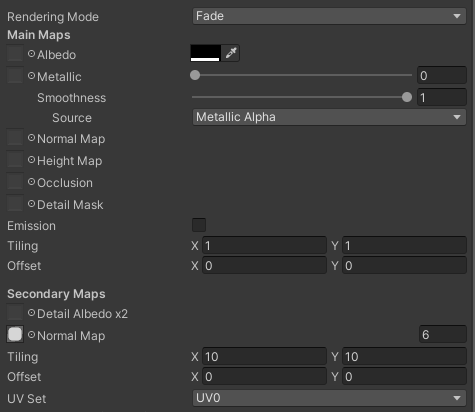

# Games Engine 1 - Assignment

## <u>**Alien Invaders 3D**</u>

This project was created in Unity 3D engine using various components and MonoBehaviour scripts.  

### **Gameplay**  

   

### **Scenes**

Project consist only of one scene, "Alien Invaders 3D". All objects are created or stationed within this scene.

### **Initial objects**

There are 4 initial objects on scene:
- Cage
- Alien Fleet
- Player's Tower
- Main Camera

Cage is just a limiting box, consists of 4 walls and a floor, using SceneColor material. SceneColor is solid Black color with ~20% transparency.  

Cage also has 6 spotlights to illuminate area - 4 in each corner at the bottom, working as regular spotlight. One over the top of alien fleet, and another at center of the floor, again illuminating alien fleet.

Alien Fleet and Player's Tower are placeholders (empty objects) used to spawn and control game behaviour.

Main Camera is responsible for cinematics, camera movement and shooting.

### **Supplementary objects**
There are some additional objects used in game. 

**Prefabs:**
- DefenderCube
- AlienCube
- Shot
- AlienShot

DefenderCube (Green) and AlienCube (no colour) are used as a simple building block of Player's tower and Alien Saucers respectively. Both are using AlienColour or DefenderColour, which are ~20% transparent with additional Normal Map overlay and make them look like Jelly cubes.

Shot and AlienShot are prefabs for shooting phase, which will be described below.

**Non-physical:**
- BigShip
- MediumShip
- SmallShip
- DirectionalLight

DirectionalLight is a regular light that will be spawned to illuminate destruction of Player's tower.

Rest of the objects are placeholders for various types of alien saucers and used to build and control behaviour of alien ships.

### **Scene start**

At the start of the scene camera is in free flight mode using CameraBind script. Controls relative to camera's orientation used:
- [ W ] or [ Up ]    - flight forward
- [ S ] or [ Down ]  - flight back
- [ A ] or [ Left ]  - flight to left (strafe)
- [ D ] or [ Right ] - flight to right (strafe)
- [ R ]              - Ascend up
- [ F ]              - Descend down
- [ Space ]          - Start game and move to the tower
- [ Esc ]            - Quit game

During this time both **DefenderTower** and **AlienFleet** use scripts to build respective objects around them.

**DefenderTower** uses **PlayerBuilder** script, *OnStart* method start *BuildTower*() Co-routine, which uses blueprint (array of 0/1 of size 6x7x11) to place building cubes underneath spawn point into model.

**AlienFleet** uses **FleetBuilder** script to build a set to variables (*fleetWidth*, *fleetDepth* and *fleetHeight*) to determine how many saucers per row (width), how many rows per same level/height (depth) and how many levels and type of saucer on each level (height).

**FleetBuilder** at the start randomizes orientation of the fleet around vertical (Y) axis, then starts *BuildFleet* Co-routine and *MoveFleet* Co-routine. *MoveFleet* does nothing untill all game objects are spawned and camera moved into tower.

*BuildFleet* places non-physical **BigShip**, **MediumSheep** and **SmallShip** objects into grid underneath **AlienFleet** coordinates where saucers will be created.

Each individual \*Ship object on start uses blueprint (similar array to what was used for Defender Tower's creation) and spawns **AlienCubes** underneath into complete saucers. Each cube painted in a hue from green to blue to red, based on it's height from the ground (lower height, more red the hue).

Each saucer is a 3D pixelized representation of alien ships from original Space Invaders.

Once fleet is completely built and in 5 seconds after that camera is forced to move to Player's DefenderTower.

### **Cinematic interlude**

After player presses [ Space ] in free move or after 5 seconds after alien fleet is built, flag *isInCinematicMove* set to true at the **CameraBind** of camera's script. This leads to disabling all free movement controls and adds cinematic move from camera's current position to top of the Player's tower. 

Quaternion.Lerp is used to smoothly look from current direction to the tower over time (speed * Time.deltaTime), and Vector3.Lerp is used to move from current position to tower over time (again speed * Time.deltaTime).

Once camera is close enough to the tower, camera cinematically forced to look at the AlienFleet again using Quaternion.Lerp over time.

At the end of this intro isInTower flag at **CameraBind** camera's script set to true, canShoot *flag* of **PlayerShooting** camera's script is also set to true. And all objects (camera, fleet, tower) *ready* flags are set to true.

### **Gameplay**

Once all *ready* flags are set to tue and camera attached to the tower, camera's *OnGUI*() method of **CameraBind** script draws a crosshair 2D texture on GUI and gameplay starts.

There are multiple actions involved in the gameplay:

1. <u>**Player movement**</u>  

**Camera**'s *OnUpdate* method of **CameraBind** script enables camera to be rotated around using mouse. Camera can't be tilted down below horizon (0 degrees)

**DefenderTower**'s *OnUpdate*() method of **PlayerBuilder** allows to move around **Cage**'s floor, but prevents from passing through walls.

Also tower itself over time slowly orients itself to camera's orientation using Quaternion.Lerp and rotation around vertical (Y) axis.

Player's controls:
- [ W ] or [ Up ] - Move forward
- [ S ] or [ Down ] - Move backward
- [ A ] or [ Left ] - Strafe left
- [ D ] or [ Right ] - Strafe right
- [ LMB ] or [ L.Ctrl ] - Fire
- [ Q ] - Suicide self-destruct
- [ Esc ] - Quit game.

2. <u>**Alien Fleet movement**</u>  

**AlienFleet**'s *MoveFleet*() Co-routine engages whole fleet. As with original game, saucers are moved in a descreet step-like movement, jumping to right or left relative to fleet's orintation. Whole fleet moved one step a time, so all child items (saucers) are moved along.

Delay between steps for *WaitforSeconds*() determined by distance between out-most saucers in any row/pillar/depth. This is relative to initial fleet sizes.

If even one saucer remains in left-most position in any row and one in righ-most position of anothe raw, so difference is considered to be maximum (or unchanged). Same for any height (top-most and bottom-most) and depth (front-most and back-most). Formula is 0.1s + (0.9s) * Ratio. So if Ratio is 0% (only one saucer left altogether) delay is 0.1s, and if all dimentions are preserved (can be done with 2 saucers in opposit corners of the fleet), delay is 0.1+0.9 = 1.0s.

Ratio is calculated as (dx + dy + dz) / (*fleetWidth* - 1 + *fleetHeight* - 1 + *fleetDepth* - 1)  
where:
- dx - difference between left-most and right-most saucers divided by saucer+spacer width
- dy - difference between top-most and bottom-most saucers divided by saucer and spacer height
- dz - difference between front-most and back-most saucers divided by saucer and spacer depth

Each **AlienCube** has a Kinematic Rigid Body and can detect a collision. If at any time any cube detects collision with the wall using *OnCollisionEnter*() method of **SaucerCollision** script, it sends signal to **AlienFleet** script **FleetBuilder** using *RandomCollisionNotification*() method. As multiple blocks most likely will notify fleet about collision at the same time, all notification add randomized delay so **FleetBuilder** can detect recieve only one (first) and ignore rest till next step.

Right after collission notification **FleetBuilder** script changes the direction of the fleet (left or right) for the next step and also calls *MoveDown*() method of each **Saucers**'s **MoveSaucer** script.

This in turn moves each **Saucer** of any type by *saucerHeight* units down and re-colors all cubes into a new hue (based on height, same way as it done during fleet creation).

After each step saucer at the bottom of each pillar has a chance to shoot at player.

3. <u>**Player shooting**</u>  

By pressing [ Left Control ] or [ Left Mouse Button ] player will shoot at saucers.

Shooting is defined in *OnUpdate*() method of **PlayerShooting** script of **PlayerTower**. It detects if **Shot** object (or player's projectile) doesn't exist (if so, do nothing) as with original, only one projectile can exist at the same time, and if player missed - need to wait for it to disappear from the area.

Mentioned above script instantiates prefab **Shot**, moves it to camera + 1 unit in front where camera looks to, add same rotation as **Camera** and rotates additionaly 90 degrees around horizontal (X) axis, so top of the shot is pointed at the enemy. **Shot** flight independetly staight using **OnUpdate** method of **ShotFlight** script.

If **Shot** goes beyond coordinates of the walls of the **Cage** (in any direction), it is instantly destroyed allowing player to shoot again.

4. <u>**Alien Fleet shooting**</u>  

At each movement step alien saucers can shot at the player. Chance of the shot is calculated by formula: 100 / (3 * Saucers left). So the less saucers left on the screen, the higher chance any of them will shoot. With only one ship left of the fleet, chance is 33.34%.

To find a **Saucer** at the bottom of pillar, it parces each child object and get's coordinates (x, y, z) and adds them to the Dictionary\<x, Dictionary\<z, y\>\>. With inside dictionary being populated only with lowest possible y. 

After that it goes again over each child, finds if it's coordinates are in this Dictionary and determines if it need to shoot. If so, it calls *Shoot*() method of **Saucer**'s **SaucerShooting** script.

*Shoot*() method instantiates a **AlienShot** prefab, places it 2 units below **Saucer**, rotates towards **PlayerTower** or **Camera** and rotates additionally 90 degrees over horizontal (X) axis to point it at player. **AlienShot** is four times bigger than player's shot, but also four times slower, but too has a straight flight path and does so independently from **Saucer**.

**AlienShot** is not limited by being only one in whole game, so same **Saucer** can shot multiple times on each step, or even multiple **Saucers** can shot at the same time. The less **Saucers** left in area, the more often they shoot.

Also same as with player's **Shot** it is destroyed once it moves beyond coordinates of any of the wall or the floor of the **Cage**.

**AlienShot** uses NoiseShader in it's material to change colours as it flies, and was introduced by Bryan on lectures.

5. <u>**Collisions and exlosions**</u>

All **Shots** and **AlienShots** have Kinematic Rigid Body and react to collisions in *OnCollisionEnter*() method of **ShotFlight** and **ShotFlightAlien** scripts.

This detects collisions between:
- **Shot** and **AlienShot** so player can defend by shooting them too (but it is quite hard)
- **Shot** and any **AlienCube** to detect hit at the **Saucer**
- **AlienShot** and any **DefenderCube** to detect hit at **PlayerTower**

At the collision between shots, both are just destoryed.

At the collision between **Shot** and **AlienCube**, *RandomExplode*() method of **Saucer**'s **SaucerExplode** script is called, which after random small delay initiates *Explode*() method of the same script. This is done because **Shot** due to framerate ans it's speed can collide with multiple cubes of the same **Saucer**.

*Explod*() method for each **AlienCube** brick of **Saucer**'s body do following:
- Remove collision box
- Add gravity to the Rigid Body
- Make Rigid Body non-Kinematic (and following gravity)
- Add mass and additional downwords force (so they fall faster)
- Add random velocity in random direction

This leads to spectacular explosion.

After this **Saucer** object is destroyed and removed from **AlienFleet**.

If **AlienShot** collides with **PlayerTower** then it calls *RandomExplode*() method of **PlayerExplode** script of **PlayerTower**.

This makes game end.

### **Game End**

There are two ends:
- Player destroys all saucers, effectively wiping out **AlienFleet**
- Player get's hit by **AlienShot**

In second part crosshair texture is removed from GUI, camera cinematically rotated towards tower and moved at some point on the floor about 50 units away using *OnUpdate*() method of **CameraBind** script and *isInExplosionMove* flag. Coordinates are depending on current tower's location (which quadrant of the floor), and camera leap directed from tower to opposite quadrant to awoid jumping into walls.

Also new **DirectionalLight** is instantiated to highlight player's demise.

After camera is moved close to intended point, explosion sequence initiated using *readyForExplosion* flag and *Explode*() Co-routine of **PlayerExplode** script at **PlayerTower**. 

This is very similar to **Saucer**'s *Explode*() method, as for each and every **DefenderCube** it:
- Remove collision box
- Add gravity to the Rigid Body
- Make Rigid Body non-Kinematic (and following gravity)
- Add mass and additional downwords force (so they fall faster)
- Add random velocity in random direction

**DefenderCube** velocity is higher than that of **AlienCube**, so explosion is more violent.

After that camera is returned to free flight mode, same as at the beginning, and player can fly around remains of the **AlienFleet**, which is frozen in space and time.

To exit game press [ Esc ].

  
  
  
# Original ideas proposed
1) Air dancers, and they dances to the music.  
   Inspired by:  
   

2) Colourful blobs - game where you play as a blob and "eat" other smaller blobs (or being eaten by bigger blobs)  
   Blobs being randomly generated around and either run from bigger blobs, or persuade smaller blobs, changing their own color based on what they eat  
   
   
3) Space invaders! But 3D:  
   
   
